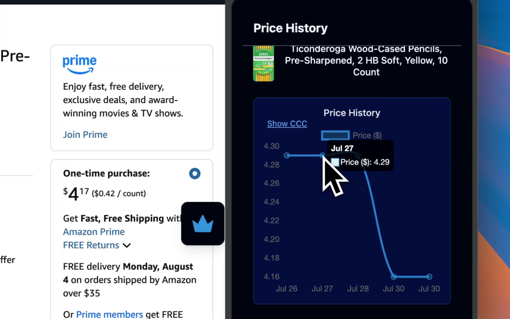
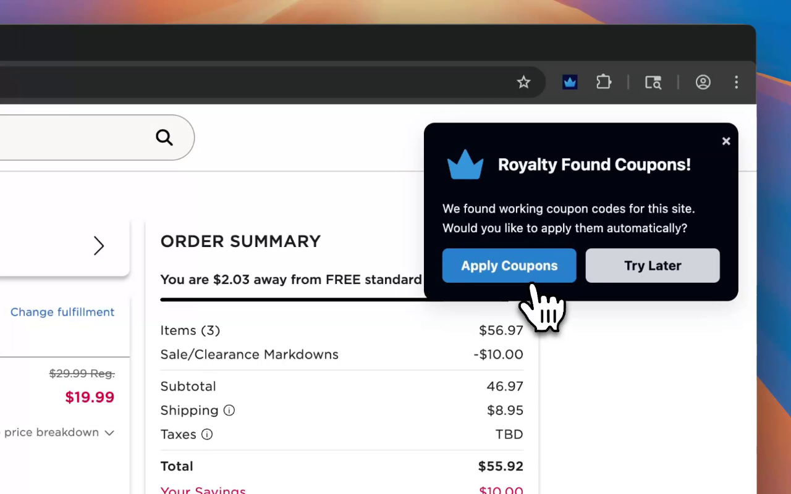
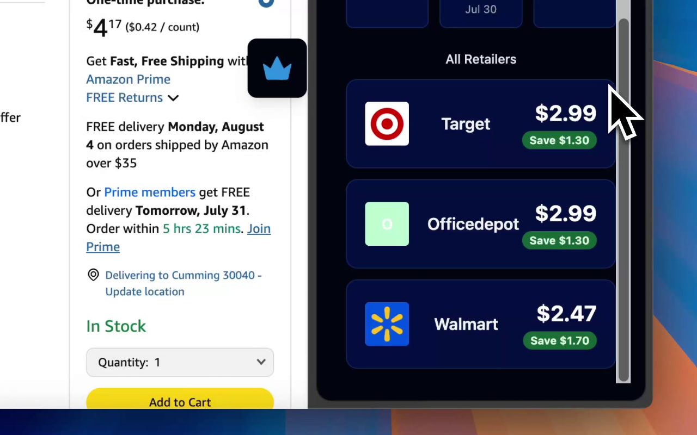

# 🛍️💸 Royalty: An Open Source Shopping Assistant

Royalty is a browser extension that saves you money on the products you love. Royalty searches the internet for coupon codes and applies them automatically to find the best deal for you. In addition, Royalty also provides prices from other retailers and price history charts so you can make an informed purchasing decision when shopping online!


---
## 🖼️ Images

<div>
  
  
  
</div>

---

## ✨ Features

### 🧾 Coupon Finder & Auto-Applier
- Scrapes the web to find relevant coupons for supported websites.
- Automatically applies the best coupon when possible to save you time and money.

### 📈 Price History Tracker
- Adds a price graph directly onto product pages using the Chrome sidepanel.
- Shows historical pricing trends so you can decide when to buy.

### 🏷️ Retailer Price Comparison
- Identifies the same product across multiple retailers.
- Displays prices side-by-side so you know where to get the best deal.

---
## 🔗 Links

- **Website:** [https://www.joinroyalty.app](https://www.joinroyalty.app)

-  [**Chrome Web Store:**](https://chromewebstore.google.com/detail/royalty-open-source-shopp/ggmkbfibnpcdgooafhjljadolcoepndj?pli=1) 

---
## 📦 Dependencies

To build and run Royalty locally, make sure you have the following installed:

- [TypeScript](https://www.typescriptlang.org/)
- [pnpm](https://pnpm.io/) (preferred over npm or yarn)

---

## ⚙️ Build Instructions


**1. Clone the repository**

```bash
git clone https://github.com/your-username/royalty.git
cd royalty
```

**2. Install dependencies**

```bash
pnpm install
```

**3. Start development mode** (for hot reload while editing)

```bash
pnpm dev
```

Or build for production:

```bash
pnpm build
```


**4. Load the extension into Chrome manually**

- Open \`chrome://extensions/\` in your browser.  
- Enable **[Developer Mode](https://support.google.com/chrome/thread/155712634/where-do-i-go-to-turn-on-the-chrome-developer-mode?hl=en)** (toggle in the top-right corner).  
- Click **Load Unpacked**.  
- Select the \`dist/\` folder inside the project directory.

---

## 🎬 Demos

https://github.com/user-attachments/assets/5cb73dfd-b304-4bb5-84c0-df113838702e

https://github.com/user-attachments/assets/c8353de6-518c-4cd7-813b-868dcd2be271

---

## Credits

Based on [Chrome Boilerplate](https://github.com/Jonghakseo/chrome-extension-boilerplate-react-vite) by [Jonghakseo](https://github.com/Jonghakseo)
